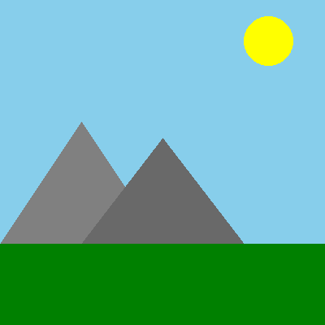

# Image Split and QR Code Reconstruction

This Python project allows you to split an image into quadrants, encode each quadrant as a QR code, and then reconstruct the original image by decoding the QR codes. It consists of two main scripts: `Splitting_into_QR_Code.py` and `Reconstruction.py`.

---

## Project Structure

```
project-folder/
│
├─ README.md
├─ src/
│   ├─ Splitting_into_QR_Code.py
│   └─ Reconstruction.py
└─ images/
    ├─ example_input.png
    ├─ reconstructed_example.png
    └─ qr_codes/
        ├─ qr1.png
        ├─ qr2.png
        ├─ qr3.png
        └─ qr4.png

```

---

## Features

1. **Splitting an Image into QR Codes**
   - Takes an input image.
   - Splits it into 4 equal quadrants.
   - Encodes each quadrant into a separate QR code image.

2. **Reconstructing the Original Image**
   - Takes the 4 QR code images.
   - Decodes each QR code to extract the quadrant images.
   - Reconstructs the original image from the quadrants.

---

## Requirements

- Python 3.x
- `qrcode`
- `opencv-python`
- `Pillow`
- `pyzbar` (for QR code decoding)

Install dependencies using pip:

```bash
pip install qrcode opencv-python Pillow pyzbar
```

---

## Usage

### 1. Split and Encode Image

```bash
python Splitting_into_QR_Code.py --input image.png --output_folder qr_codes/
```

- `--input` : Path to the input image.
- `--output_folder` : Folder where generated QR codes will be saved.

This will generate 4 QR code images (one for each quadrant) in the specified output folder.

### 2. Decode and Reconstruct Image

```bash
python Reconstruction.py --input_folder qr_codes/ --output reconstructed_image.png
```

- `--input_folder` : Folder containing the 4 QR code images.
- `--output` : Path to save the reconstructed image.

---

## Example

1. Input Image:



2. Generated QR Codes:


3. Reconstructed Image:


---

## Contributing

Feel free to fork this repository and submit pull requests for improvements, such as:
- Supporting more quadrants (e.g., 9 or 16 pieces)
- Error correction for QR code decoding
- Command-line argument enhancements

---

## License


This project is licensed under the MIT License. See `LICENSE` for details.
